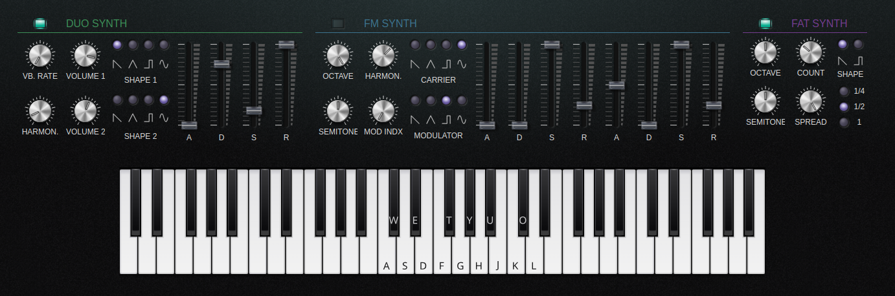

# Vintage analog web synth

#### Description:
This is a JavaScript, HTML and Tone.js (Web Audio API) monophonic synthesizer.

This synthesizer has the folowing features:
* 3 Tone.js built-in synthesizers:
  * DuoSynth
  * FMSynth
  * Fat synth (a Tone.js PolySynth with a Tone.js FatOScillator)

### How to run
Just download the project and open the index.html file in a browser. No web server or compilation required, but an internet connection is required, because the Tone.js library is not included in the project, it's loaded from a CDN, when the main page is loaded.

### Compatibility
Works most certainly with Google Chrome. Unfortunately, this web synthesizer does not work perfectly on Firefox, because Firefox is missing some essential JavaScript Web Audio API functions.

So, Google Chrome browser is recomended.

### License
The source code is licensed under the MIT license.

The images that I made myself are licensed under Creative Commons CC0.